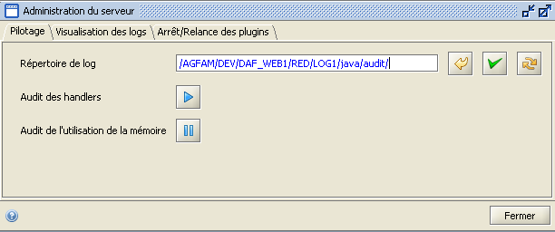

## Description

Cette page décrit le fonctionnement de l'IHM de configuration fournie par le plugin d'administration.

L'IHM contient 3 onglets permettant : 

* d'activer/désactiver l'audit sur les handlers et/ou la mémoire et de configurer le répertoire contenant les log des ces audits,
* de visualiser des logs, 
* d'arrêter/relancer des plugins du serveur. 

### Audit sur les handlers et/ou la mémoire



Cet onglet permet :
* de positionner ou modifier le répertoire contenant les logs d'audit (pour annuler le chemin saisi , faire appliquer le chemin saisi  et recharger la configuration statique ) ,
* d'activer les services d'audit qui sont arrêtés (en cliquant sur l'icône ) et de désactiver ceux qui tournent (en cliquant sur l'icône ).

### Visualisation des logs

Cet onglet liste les fichiers de logs du serveur qui sont visualisables :
* server-java.log,
* server.log,
* audit.log (fichier contenant les traces des audits des handlers et/ou de la mémoire si ils sont activés),
* ....

Pour cela, il suffit de sélectionner le nom du fichier que l'on souhaite visialiser dans la liste déroulante, puis de cliquer sur le bouton ```Afficher```. Le contenu du fichier apparaît alors dans la zone de texte située en dessous.

### Arrêt/Relance des plugins du serveur

Cet onglet contient la liste des plugins présents côté serveur.

<table style='background-color: #FFFFCE;'>
       <colgroup><col width='24'><col></colgroup>
         <tr>
           <td valign='top'></td>
           <td><p>
L'arrêt et la relance de ces plugins doivent se faire dans un ordre précis (gestion des dépendances) et donc doivent être réalisés avec prudence sous peine de rendre instable le serveur.
D'autant plus que la liste affichée n'est pas ordonnée.
</p></td>
          </tr>
</table>


<table style='background-color: #FFCCCC;'>
       <colgroup><col width='24'><col></colgroup>
         <tr>
           <td valign='top'></td>
           <td><p>
Il ne faut surtout pas arrêter le plugin gérant cette IHM c'est à dire le *com.agf.administration.server.plugin.AdministrationServerPlugin*.
</p></td>
          </tr>
</table>

